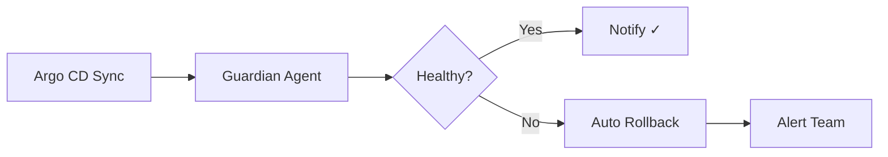

# agent-deploy-guardian

[](https://github.com/Jai-Gogineni/agent-deploy-guardian/actions)
[](LICENSE)
[](https://www.typescriptlang.org/)

Deployment guardian agent that monitors Argo CD sync operations, validates post-deploy health checks, triggers automatic rollback on failure, and notifies teams via Slack.

## How It Works



## Quick Start

```bash
git clone https://github.com/Jai-Gogineni/agent-deploy-guardian.git
cd agent-deploy-guardian
npm install
cp .env.example .env  # Add your API keys
npm run build
```

## Configuration

| Variable | Required | Description |
|----------|----------|-------------|
| `ARGOCD_URL` | Yes | Argo CD server URL |
| `ARGOCD_TOKEN` | Yes | Argo CD API token |
| `SLACK_WEBHOOK` | Yes | Slack incoming webhook URL |

## Example Usage

```typescript
import { DeployGuardianAgent } from "./src/agent";

const guardian = new DeployGuardianAgent(
  process.env.ARGOCD_URL!,
  process.env.SLACK_WEBHOOK!
);
const status = await guardian.checkSync("my-service");
if (status.status !== "Synced") {
  await guardian.triggerRollback("my-service");
}
```

## Architecture

Built with TypeScript for type safety, uses the Anthropic SDK for LLM capabilities, and follows a single-responsibility pattern where each agent has one clear job. Designed to be composable — agents can be chained together for complex workflows.

## Contributing

See [CONTRIBUTING.md](CONTRIBUTING.md) for guidelines.

## Author

**Jai Gogineni** — [jaigogineni.com](https://jaigogineni.com) · [LinkedIn](https://uk.linkedin.com/in/jai-gogineni-9a396654)
