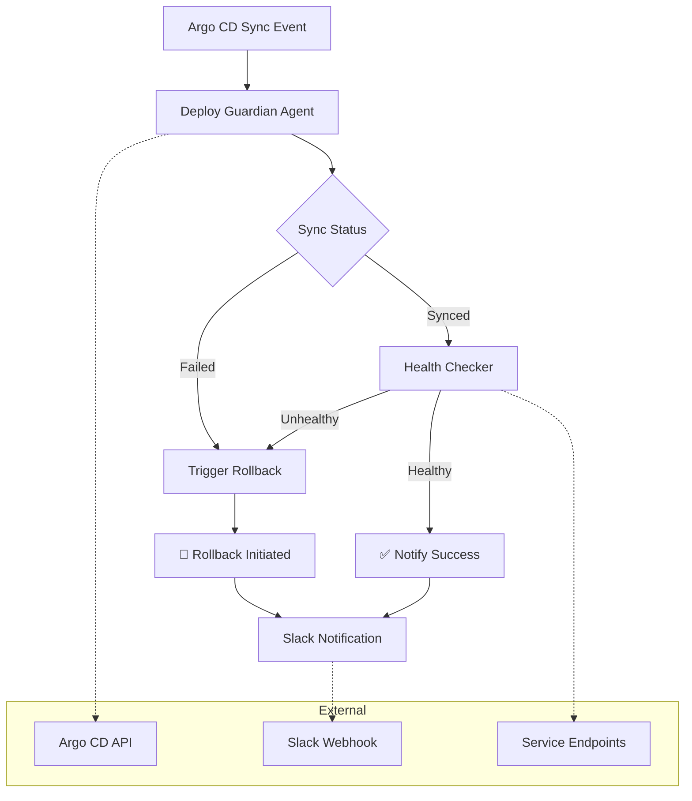

# agent-deploy-guardian

[](https://github.com/Jai-Gogineni/agent-deploy-guardian/actions/workflows/ci.yml)
[](https://opensource.org/licenses/MIT)
[](https://www.typescriptlang.org/)
[](https://modelcontextprotocol.io)

> Deployment guardian — watches deployments, validates health, auto-rollbacks

## Architecture



## Quick Start

```bash
# Clone the repository
git clone https://github.com/Jai-Gogineni/agent-deploy-guardian.git
cd agent-deploy-guardian

# Install dependencies
npm install

# Build
npm run build
```

## Configuration

Set the following environment variables:

| Variable | Description |
|----------|-------------|
| `ARGOCD_SERVER` | Argo CD server URL |
| `ARGOCD_TOKEN` | Argo CD API token |
| `SLACK_WEBHOOK_URL` | Slack incoming webhook URL |

## Project Structure

```
src/
├── agent.ts           # MCP server entry point
├── argocd-client.ts   # Argo CD API wrapper
├── health-checker.ts  # Post-deploy endpoint health validation
└── notifier.ts        # Slack webhook notifications
```

## MCP Tools

| Tool | Description |
|------|-------------|
| `watch_deployment` | Watch sync status and validate post-deploy health |
| `trigger_rollback` | Manually trigger a rollback |
| `get_sync_status` | Get current Argo CD application sync status |

## License

MIT © 2024 Jai Gogineni
